## LTI: El ATS de Nueva Generación

**Visión del Producto**

LTI está desarrollando una plataforma ATS de próxima generación que transforma radicalmente cómo las organizaciones atraen, evalúan y contratan talento. Más allá de ser un sistema de seguimiento, LTI se posiciona como un **aliado estratégico para la toma de decisiones de talento**, combinando automatización inteligente, colaboración fluida e inteligencia artificial aplicada.

**Propuesta de Valor**

- **Eficiencia Operativa Aumentada**: Reducción de hasta el 60% en tareas administrativas mediante flujos de trabajo inteligentes, permitiendo a HR enfocarse en actividades de alto impacto como experiencia del candidato y employer branding.

- **Colaboración en Tiempo Real**: Plataforma unificada que conecta reclutadores, hiring managers y stakeholders con visibilidad completa del pipeline, feedback estructurado y toma de decisiones sincronizada, eliminando silos y acelerando el time-to-hire.

- **Automatización Inteligente**: Desde screening inicial hasta programación de entrevistas, el sistema aprende y optimiza procesos recurrentes, liberando hasta 20 horas semanales por reclutador.

- **IA Como Copiloto de Contratación**: Asistente de IA que genera descripciones de puesto optimizadas, identifica candidatos con mayor fit cultural y técnico, sugiere preguntas de entrevista personalizadas y detecta sesgos inconscientes en el proceso de selección.

**Ventajas Competitivas Clave**

1. **Velocidad sin sacrificar calidad**: Procesos 40% más rápidos manteniendo rigor en la evaluación
2. **Experiencia del candidato superior**: Comunicación proactiva y transparencia en cada etapa
3. **Decisiones basadas en datos**: Analytics predictivo y métricas accionables en tiempo real
4. **Escalabilidad adaptativa**: Desde startups hasta enterprise, sin complejidad innecesaria

LTI no solo digitaliza la contratación; **la reinventa como ventaja competitiva sostenible**.

## Funciones Principales del ATS LTI

### 1. **Gestión Inteligente del Pipeline de Candidatos**

- **Tablero Kanban Visual**: Vista drag-and-drop de candidatos por etapas del proceso (Aplicados → Screening → Entrevistas → Oferta → Contratado)
- **Perfiles Enriquecidos**: Consolidación automática de datos desde CV, LinkedIn, portfolios y redes sociales
- **Scoring Automático**: Algoritmo de IA que califica candidatos según criterios configurables (skills, experiencia, fit cultural)
- **Base de Talento**: Pool de candidatos históricos reactivable para futuras vacantes

### 2. **Automatización del Ciclo de Reclutamiento**

- **Publicación Multi-canal**: Distribución automática de ofertas a job boards, redes sociales y portales especializados
- **Screening de CVs con IA**: Filtrado inteligente que identifica candidatos relevantes y descarta automáticamente los no cualificados
- **Comunicación Automatizada**: Templates personalizables y envío programado de emails según etapa (confirmación, rechazo, invitación a entrevista)
- **Agendamiento Inteligente**: Coordinación automática de entrevistas según disponibilidad de candidatos y entrevistadores
- **Generación de Reportes**: Dashboards y métricas automáticas (time-to-hire, funnel de conversión, fuentes más efectivas)

### 3. **Colaboración en Tiempo Real**

- **Workspace Compartido**: Espacio unificado donde HR y hiring managers ven el mismo pipeline actualizado
- **Sistema de Evaluación Colaborativo**: Scorecards estructurados donde múltiples entrevistadores pueden dejar feedback simultáneo
- **Comentarios y Menciones**: Conversaciones contextuales en cada perfil de candidato (@menciones para notificar stakeholders)
- **Aprobaciones y Workflows**: Flujos configurables que requieren sign-off de managers antes de avanzar candidatos
- **Notificaciones Inteligentes**: Alertas personalizadas por rol (nuevo candidato top, entrevista pendiente de feedback, candidato en riesgo)

### 4. **Asistencia de Inteligencia Artificial**

- **Generador de Job Descriptions**: IA crea descripciones optimizadas basándose en títulos, departamento y nivel de seniority
- **Recomendaciones de Candidatos**: Sugerencias proactivas de perfiles del talent pool que encajan con nuevas vacantes
- **Preguntas de Entrevista Personalizadas**: Generación automática de cuestionarios técnicos y conductuales según el rol
- **Análisis de Sentimiento**: Evaluación del tono en comunicaciones escritas de candidatos
- **Detección de Sesgos**: Alertas cuando patrones de selección muestran preferencias no objetivas
- **Predicción de Éxito**: Modelos que estiman probabilidad de aceptación de oferta y retención a largo plazo

### 5. **Experiencia del Candidato**

- **Portal de Candidatos**: Espacio donde los aplicantes ven el estado de su proceso en tiempo real
- **Aplicación Simplificada**: Formularios adaptativos que solicitan solo información relevante
- **Comunicación Transparente**: Actualizaciones automáticas en cada cambio de etapa
- **Feedback Constructivo**: Opción de enviar comentarios personalizados a candidatos rechazados
- **Programación Self-Service**: Candidatos eligen slots disponibles para entrevistas sin intermediarios

### 6. **Analytics y Business Intelligence**

- **Dashboard Ejecutivo**: Métricas clave (vacantes abiertas, tiempo promedio de contratación, tasa de aceptación)
- **Análisis de Fuentes**: ROI de cada canal de reclutamiento (LinkedIn, referidos, job boards)
- **Embudo de Conversión**: Visualización de drop-off en cada etapa del proceso
- **Benchmarking**: Comparación de métricas contra estándares de industria
- **Reportes Personalizables**: Exportación de datos para análisis avanzados

### 7. **Integraciones y Ecosistema**

- **HRIS/HCM**: Sincronización bidireccional con sistemas de nómina y gestión de empleados
- **Herramientas de Evaluación**: Integración con plataformas de tests técnicos (HackerRank, Codility)
- **Verificación de Antecedentes**: Conexión con servicios de background checks
- **Calendar Sync**: Integración con Google Calendar, Outlook, etc.
- **API Abierta**: Extensibilidad para conexiones custom

# LEAN CANVAS - LTI ATS

## **1. PROBLEMA**
**Top 3 problemas identificados:**

- **Procesos manuales y repetitivos**: Los equipos de HR invierten 60-70% de su tiempo en tareas administrativas (publicar ofertas, filtrar CVs, coordinar entrevistas)
- **Falta de colaboración efectiva**: Desconexión entre reclutadores y hiring managers genera retrasos, feedback perdido y decisiones inconsistentes
- **Time-to-hire elevado**: Procesos lentos resultan en pérdida de candidatos top y costos operativos altos (promedio 42 días en llenar una vacante)

**Alternativas actuales:**
- ATS legacy (Workday, Greenhouse, Lever): funcionales pero poco intuitivos, caros, no aprovechan IA
- Hojas de cálculo + email: económico pero caótico, sin trazabilidad
- Soluciones fragmentadas: múltiples herramientas sin integración

---

## **2. SEGMENTOS DE CLIENTES**

**Early Adopters:**
- **Startups tecnológicas (50-200 empleados)**: Equipos lean que necesitan escalabilidad rápida, valoran innovación y UX moderna
- **Scale-ups en hipercrecimiento**: Empresas contratando >10 personas/mes que sufren con procesos desorganizados
- **Recruiting agencies boutique**: Agencias especializadas que necesitan herramientas colaborativas para trabajar con múltiples clientes

**Características comunes:**
- Tech-savvy, abiertos a adoptar nuevas tecnologías
- Dolor claro con soluciones actuales
- Presupuesto para SaaS B2B ($200-2000/mes)

---

## **3. PROPUESTA DE VALOR ÚNICA**

**High-Level Concept:**
*"El Notion de los ATS: colaborativo, inteligente y deliciosamente simple"*

**Mensaje principal:**
*Contrata 3x más rápido sin sacrificar calidad. LTI combina automatización inteligente con IA y colaboración en tiempo real para transformar tu proceso de reclutamiento en ventaja competitiva.*

**Beneficios clave:**
- Reduce time-to-hire en 40%
- Libera 20 horas/semana por reclutador
- Decisiones basadas en datos, no intuición
- Experiencia de candidato nivel consumer-app

---

## **4. SOLUCIÓN**

**Top 3 características diferenciadores:**

1. **IA Copilot integrada**: Asistente que genera job descriptions, identifica candidatos ideales, sugiere preguntas y detecta sesgos
2. **Colaboración real-time**: Workspace unificado estilo Notion/Slack donde HR y managers trabajan sincronizados con feedback instantáneo
3. **Automatización inteligente**: Desde publicación multi-canal hasta scheduling, el sistema aprende y optimiza flujos

---

## **5. CANALES**

**Adquisición:**
- **Product-Led Growth**: Freemium tier (hasta 3 vacantes activas) con upgrade natural
- **Content Marketing**: Blog sobre hiring best practices, SEO para "mejor ATS", "cómo reducir time-to-hire"
- **Communities**: Presencia activa en comunidades de HR (SHRM, LinkedIn groups, Reddit r/humanresources)
- **Partnerships**: Integraciones con HackerRank, LinkedIn Recruiter, calendly-like tools
- **Outbound**: Sales dirigido a startups en crecimiento (Series A/B)

---

## **6. FLUJOS DE INGRESOS**

**Modelo de Pricing (SaaS Subscription):**

- **Starter**: $99/mes - Hasta 5 vacantes activas, 2 usuarios, funciones básicas
- **Growth**: $299/mes - Vacantes ilimitadas, 10 usuarios, automatizaciones avanzadas, IA copilot
- **Enterprise**: Custom - Usuarios ilimitados, SSO, soporte dedicado, API, SLAs

**Revenue Streams Adicionales:**
- Add-ons: Background checks premium, integración de testing técnico
- Professional Services: Onboarding personalizado, consultoría de procesos
- Marketplace: Comisiones por conexiones con job boards premium

**Proyección:**
- ARR Year 1: $300K (100 clientes en Growth)
- ARR Year 2: $1.8M (500 clientes mixtos)
- ARR Year 3: $6M+ (escalamiento + enterprise)

---

## **7. ESTRUCTURA DE COSTOS**

**Costos Fijos:**
- **Equipo fundador**: $400K/año (4 personas: PM/CEO, 2 developers, 1 designer)
- **Infraestructura Cloud**: $2K/mes inicial (AWS/GCP, crece con usuarios)
- **Herramientas**: $500/mes (GitHub, Figma, analytics, CRM)
- **Legal/Administrativo**: $20K/año

**Costos Variables:**
- **IA/ML APIs**: $0.10-0.50 por candidato procesado (OpenAI, embeddings)
- **Customer Acquisition**: $500-1500 por cliente (marketing, sales)
- **Soporte**: Escala con base de clientes

**Burn Rate inicial**: ~$40K/mes

---

## **8. MÉTRICAS CLAVE**

**Product Metrics:**
- **Activación**: % usuarios que completan primera vacante en 7 días
- **Engagement**: DAU/MAU ratio, vacantes activas por cuenta
- **Retención**: Cohort retention a 3, 6, 12 meses
- **NPS**: Net Promoter Score (objetivo: >50)

**Business Metrics:**
- **MRR/ARR**: Monthly/Annual Recurring Revenue
- **CAC**: Customer Acquisition Cost (objetivo: <$1000)
- **LTV**: Lifetime Value (objetivo: >$5000, ratio LTV:CAC de 5:1)
- **Churn Rate**: <5% mensual
- **Time to Value**: Días hasta primer candidato contratado con LTI

**Impact Metrics (para clientes):**
- Reducción en time-to-hire
- Incremento en calidad de contrataciones (retention a 12 meses)
- Horas ahorradas por reclutador

---

## **9. VENTAJA UNFAIR**

**¿Qué tendrá LTI que sea difícil de copiar?**

1. **Datos propios de entrenamiento**: Modelos de IA que mejoran con cada contratación en la plataforma (efecto de red)
2. **Equipo con expertise dual**: Founders con experiencia combinada en HR-tech + AI/ML
3. **UX excepcional**: Diseño product-led que genera adopción orgánica y viral dentro de organizaciones
4. **Early partnerships estratégicos**: Integraciones exclusivas tempranas con players clave (LinkedIn, assessment platforms)


# CASOS DE USO PRINCIPALES - LTI ATS

## **Caso de Uso 1: Publicación y Screening Automatizado de Vacantes**

### **Actor Principal**
Reclutador / HR Manager

### **Objetivo**
Publicar una nueva vacante y recibir automáticamente candidatos cualificados filtrados por IA, eliminando el trabajo manual de screening inicial.

### **Flujo Principal**

1. **Creación de vacante**: El reclutador ingresa título del puesto, departamento y nivel de seniority
2. **Asistencia de IA**: El sistema genera automáticamente:
   - Job description optimizada (responsabilidades, requisitos, beneficios)
   - Criterios de evaluación sugeridos (hard skills, soft skills, experiencia mínima)
   - Preguntas de screening personalizadas
3. **Publicación multi-canal**: Con un clic, la vacante se distribuye a:
   - Portales de empleo (LinkedIn, Indeed, InfoJobs)
   - Página de careers de la empresa
   - Redes sociales corporativas
4. **Recepción de aplicaciones**: Los candidatos aplican desde cualquier canal
5. **Screening automático con IA**: El sistema:
   - Extrae información de CVs (experiencia, educación, skills)
   - Califica cada candidato con un score (0-100)
   - Clasifica automáticamente: "Top Candidate", "Qualified", "Maybe", "Not a Fit"
   - Envía automáticamente email de confirmación personalizado
6. **Bandeja de candidatos cualificados**: El reclutador accede a su dashboard y encuentra:
   - 10-15 candidatos top ya filtrados (en lugar de 200+ CVs sin revisar)
   - Highlights automáticos de por qué cada candidato encaja
   - Sugerencias de próximos pasos para cada perfil

### **Valor Entregado**

- **Tiempo ahorrado**: De 10-15 horas revisando CVs manualmente a 2 horas revisando candidatos pre-cualificados
- **Calidad mejorada**: IA identifica candidatos que podrían pasarse por alto en screening manual
- **Experiencia de candidato**: Comunicación inmediata y profesional desde el minuto uno
- **Alcance ampliado**: Publicación en múltiples canales sin esfuerzo adicional

### **Métricas de Éxito**

- % de candidatos aplicados que llegan a entrevista (objetivo: >15%)
- Tiempo desde publicación hasta primer candidato cualificado (objetivo: <24 horas)
- Satisfacción del reclutador con calidad de screening (NPS)

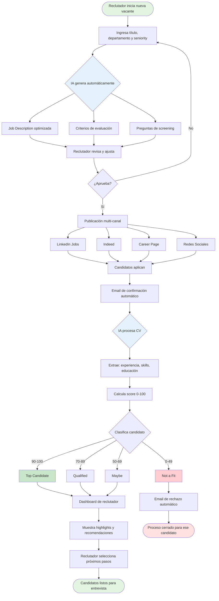

---

## **Caso de Uso 2: Evaluación Colaborativa en Tiempo Real**

### **Actor Principal**
Equipo de Contratación (Reclutador + Hiring Manager + Entrevistadores técnicos/funcionales)

### **Objetivo**
Coordinar y ejecutar el proceso de entrevistas con múltiples stakeholders, consolidando feedback estructurado para tomar decisiones rápidas y objetivas.

### **Flujo Principal**

1. **Selección de candidatos**: El reclutador mueve candidatos top de "Screening" a "Entrevista"
2. **Coordinación automática**: El sistema:
   - Identifica quién debe entrevistar según el rol (hiring manager + 2 técnicos para developer, por ej.)
   - Envía invitación a calendarios con slots disponibles
   - Candidato elige horario conveniente desde portal
   - Confirmaciones automáticas con detalles de la entrevista (link de Zoom, duración, qué esperar)
3. **Preparación inteligente**: Antes de cada entrevista, los entrevistadores reciben:
   - Perfil completo del candidato con highlights
   - Preguntas sugeridas por IA según el rol y nivel
   - Scorecard estructurado a completar
   - Contexto de entrevistas previas si las hay
4. **Realización de entrevistas**: Entrevistas se ejecutan (fuera del sistema)
5. **Captura de feedback en tiempo real**: Cada entrevistador:
   - Completa scorecard estructurado (skills técnicos, comunicación, fit cultural, etc.)
   - Calificación numérica (1-5) en cada dimensión
   - Comentarios cualitativos
   - Recomendación: "Strong Yes", "Yes", "Maybe", "No"
6. **Consolidación y decisión**: El hiring manager ve en un solo dashboard:
   - Tabla comparativa de todos los candidatos entrevistados
   - Promedio de scores y distribución de evaluaciones
   - Comentarios de todos los entrevistadores
   - Alertas de red flags o inconsistencias
   - Recomendación de IA basada en patrones históricos
7. **Notificación y siguiente paso**: El reclutador:
   - Recibe notificación cuando todos completan feedback
   - Programa reunión de calibración si hay desacuerdo
   - Avanza candidato a siguiente etapa o envía rechazo personalizado

### **Valor Entregado**

- **Velocidad de decisión**: De 5-7 días esperando feedback a decisión en <24 horas post-última entrevista
- **Calidad de evaluación**: Feedback estructurado elimina sesgos y opiniones vagas ("me gustó / no me gustó")
- **Alineación de equipo**: Todos ven la misma información, reduciendo desconexiones
- **Experiencia del candidato**: Proceso ágil y profesional, sin quedarse "en el limbo"

### **Métricas de Éxito**

- Tiempo promedio desde última entrevista hasta decisión (objetivo: <1 día)
- % de entrevistadores que completan scorecard dentro de 24h (objetivo: >90%)
- Tasa de aceptación de ofertas de candidatos "Strong Yes" unánimes (objetivo: >80%)
- Reducción en reuniones de calibración innecesarias

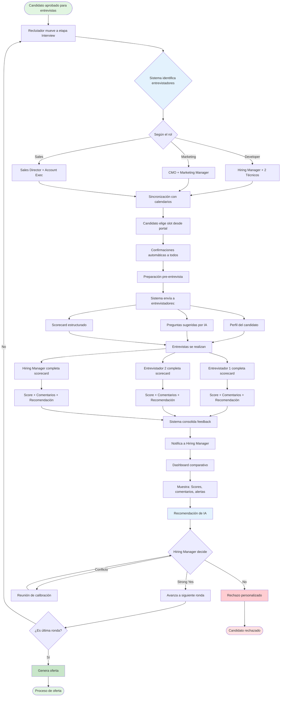

---

## **Caso de Uso 3: Análisis y Optimización Continua del Proceso**

### **Actor Principal**
Head of Talent / Director de HR / C-Level

### **Objetivo**
Obtener visibilidad estratégica del pipeline de contratación, identificar cuellos de botella y optimizar inversión en reclutamiento basándose en datos objetivos.

### **Flujo Principal**

1. **Acceso a dashboard ejecutivo**: El líder de HR ingresa a vista de analytics
2. **Métricas en tiempo real**: El sistema muestra:
   - **Funnel de conversión**: Aplicados → Screening → Entrevista → Oferta → Contratado (con % de conversión en cada etapa)
   - **Time-to-hire**: Promedio por rol, departamento, nivel de seniority
   - **Vacantes críticas**: Posiciones abiertas >45 días con alertas
   - **Pipeline health**: Ratio de candidatos activos por vacante
3. **Análisis de fuentes**: Desglose de efectividad por canal:
   - LinkedIn: 120 aplicados, 15 contratados, costo $300/contratación
   - Referidos: 30 aplicados, 8 contratados, costo $150/contratación
   - Indeed: 200 aplicados, 5 contratados, costo $500/contratación
   - **Recomendación de IA**: "Aumenta inversión en referidos, reduce Indeed"
4. **Identificación de cuellos de botella**: El sistema detecta:
   - "Etapa de entrevista técnica toma 12 días promedio (vs. 5 días industria)"
   - "Hiring Manager X tiene 8 candidatos esperando feedback >5 días"
   - "Rechazos post-oferta: 30% en Q1 (vs. 15% Q4 anterior)" → Alerta de competitividad salarial
5. **Comparativa y benchmarking**: Gráficos que muestran:
   - Performance vs. trimestre anterior
   - Comparación con benchmarks de industria (time-to-hire, cost-per-hire)
   - Proyección de contrataciones vs. meta del quarter
6. **Reportes personalizados**: Generación automática de:
   - Weekly hiring recap para C-Level
   - Monthly deep-dive para equipo de HR
   - Exportación de datos raw para análisis custom
7. **Implementación de mejoras**: Basándose en insights:
   - Ajuste de presupuesto entre canales
   - Rediseño de etapas problemáticas
   - Training para entrevistadores con scores muy dispersos
   - Actualización de salary bands si competitividad es baja

### **Valor Entregado**

- **Visibilidad estratégica**: Pasar de reportes manuales mensuales a insights en tiempo real
- **Optimización de ROI**: Reasignar presupuesto a canales con mejor retorno
- **Proactividad**: Detectar y resolver problemas antes de que escalen
- **Data-driven decisions**: Decisiones basadas en datos, no intuición o política

### **Métricas de Éxito**

- Reducción en cost-per-hire (objetivo: -20% en 6 meses)
- Mejora en time-to-hire (objetivo: -30% en 6 meses)
- Incremento en quality-of-hire (medido por retention a 12 meses)
- Aumento en % de contrataciones de canales premium (referidos, talent pool interno)

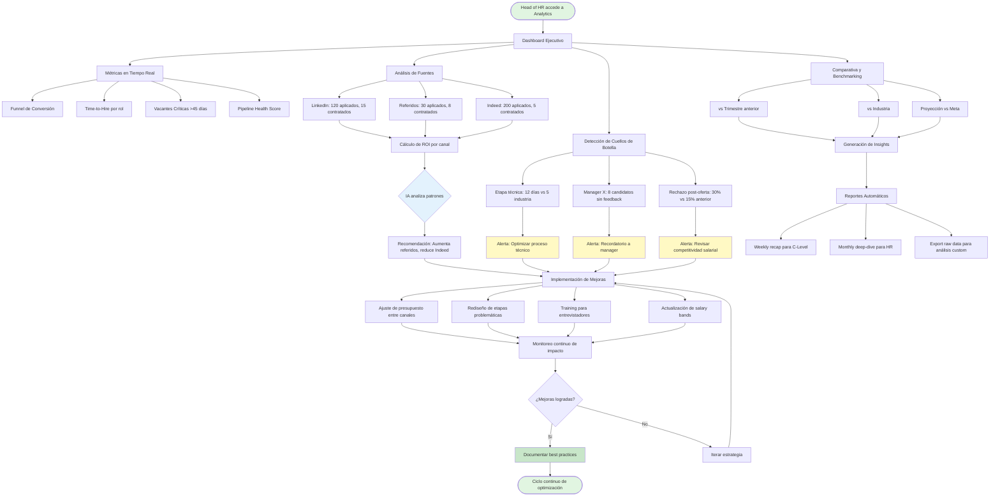

---

## Resumen Comparativo

| Caso de Uso | Actor Principal | Frecuencia de Uso | Impacto Principal |
|-------------|----------------|-------------------|-------------------|
| **1. Publicación y Screening** | Reclutador | Cada nueva vacante (~semanal) | **Eficiencia operativa** - Reduce trabajo manual 80% |
| **2. Evaluación Colaborativa** | Equipo de Contratación | Por cada candidato en entrevistas (~diario) | **Velocidad y calidad de decisión** - Reduce time-to-hire 40% |
| **3. Análisis y Optimización** | Head of Talent/C-Level | Revisión continua/semanal | **ROI y estrategia** - Optimiza inversión y predice resultados |

---

## Interrelación de Casos de Uso

Estos tres casos de uso se complementan para crear un **ciclo virtuoso de mejora continua**:

1. **Caso 1** genera datos de calidad de candidatos y efectividad de canales
2. **Caso 2** captura feedback estructurado que alimenta modelos de IA
3. **Caso 3** identifica patrones y optimizaciones que mejoran Casos 1 y 2

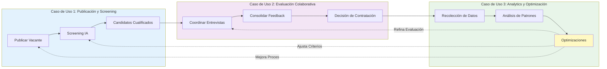

# MODELO DE DATOS - LTI ATS

## Diagrama Entidad-Relación (Mermaid)

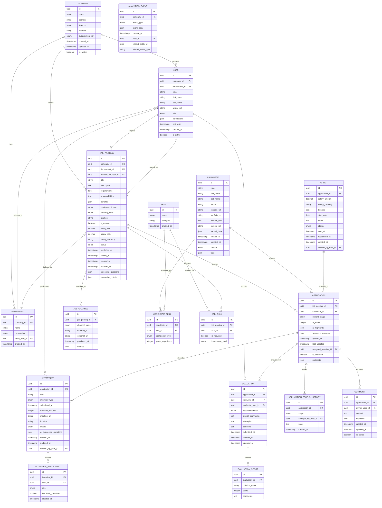

---

## Descripción Detallada de Entidades

### **1. COMPANY**
Representa la organización cliente que usa el ATS.

| Atributo | Tipo | Descripción |
|----------|------|-------------|
| id | UUID (PK) | Identificador único |
| name | STRING | Nombre de la empresa |
| domain | STRING | Dominio corporativo (ej: "lti.com") |
| logo_url | STRING | URL del logo |
| website | STRING | Sitio web corporativo |
| subscription_tier | ENUM | Plan contratado: 'starter', 'growth', 'enterprise' |
| created_at | TIMESTAMP | Fecha de registro |
| updated_at | TIMESTAMP | Última modificación |
| is_active | BOOLEAN | Estado de la cuenta |

---

### **2. USER**
Usuarios del sistema (reclutadores, hiring managers, entrevistadores).

| Atributo | Tipo | Descripción |
|----------|------|-------------|
| id | UUID (PK) | Identificador único |
| company_id | UUID (FK) | Empresa a la que pertenece |
| department_id | UUID (FK) | Departamento asignado |
| email | STRING | Email corporativo (único) |
| first_name | STRING | Nombre |
| last_name | STRING | Apellido |
| avatar_url | STRING | Foto de perfil |
| role | ENUM | Rol: 'admin', 'recruiter', 'hiring_manager', 'interviewer', 'viewer' |
| permissions | JSON | Permisos granulares |
| last_login | TIMESTAMP | Último acceso |
| created_at | TIMESTAMP | Fecha de creación |
| is_active | BOOLEAN | Usuario activo/inactivo |

---

### **3. DEPARTMENT**
Departamentos dentro de la empresa.

| Atributo | Tipo | Descripción |
|----------|------|-------------|
| id | UUID (PK) | Identificador único |
| company_id | UUID (FK) | Empresa propietaria |
| name | STRING | Nombre del departamento (ej: "Engineering", "Sales") |
| description | STRING | Descripción opcional |
| head_user_id | UUID (FK) | Usuario líder del departamento |
| created_at | TIMESTAMP | Fecha de creación |

---

### **4. JOB_POSTING**
Vacantes publicadas por la empresa.

| Atributo | Tipo | Descripción |
|----------|------|-------------|
| id | UUID (PK) | Identificador único |
| company_id | UUID (FK) | Empresa propietaria |
| department_id | UUID (FK) | Departamento solicitante |
| created_by_user_id | UUID (FK) | Usuario que creó la vacante |
| title | STRING | Título del puesto |
| description | TEXT | Descripción detallada (generada/editada por IA) |
| requirements | TEXT | Requisitos del candidato |
| responsibilities | TEXT | Responsabilidades del rol |
| benefits | JSON | Array de beneficios |
| employment_type | ENUM | Tipo: 'full_time', 'part_time', 'contract', 'internship' |
| seniority_level | ENUM | Nivel: 'entry', 'mid', 'senior', 'lead', 'executive' |
| location | STRING | Ubicación física |
| is_remote | BOOLEAN | Permite trabajo remoto |
| salary_min | DECIMAL | Salario mínimo |
| salary_max | DECIMAL | Salario máximo |
| salary_currency | STRING | Moneda (ISO 4217) |
| status | ENUM | Estado: 'draft', 'open', 'paused', 'closed' |
| published_at | TIMESTAMP | Fecha de publicación |
| closed_at | TIMESTAMP | Fecha de cierre |
| created_at | TIMESTAMP | Fecha de creación |
| updated_at | TIMESTAMP | Última modificación |
| screening_questions | JSON | Preguntas de screening generadas por IA |
| evaluation_criteria | JSON | Criterios de evaluación |

---

### **5. JOB_CHANNEL**
Canales donde se publicó una vacante.

| Atributo | Tipo | Descripción |
|----------|------|-------------|
| id | UUID (PK) | Identificador único |
| job_posting_id | UUID (FK) | Vacante asociada |
| channel_name | ENUM | Canal: 'linkedin', 'indeed', 'career_page', 'glassdoor', 'twitter' |
| external_id | STRING | ID en el sistema externo |
| external_url | STRING | URL pública de la oferta |
| published_at | TIMESTAMP | Fecha de publicación |
| metrics | JSON | Métricas (views, clicks, applies) |

---

### **6. CANDIDATE**
Personas que han aplicado o están en el talent pool.

| Atributo | Tipo | Descripción |
|----------|------|-------------|
| id | UUID (PK) | Identificador único |
| email | STRING | Email (único) |
| first_name | STRING | Nombre |
| last_name | STRING | Apellido |
| phone | STRING | Teléfono |
| linkedin_url | STRING | Perfil de LinkedIn |
| portfolio_url | STRING | Portafolio/GitHub |
| resume_text | TEXT | Texto extraído del CV |
| resume_url | STRING | URL del CV almacenado |
| parsed_data | JSON | Datos estructurados extraídos por IA (experiencia, educación) |
| created_at | TIMESTAMP | Primera aplicación |
| updated_at | TIMESTAMP | Última modificación |
| source | ENUM | Origen: 'job_board', 'referral', 'direct', 'agency', 'linkedin' |
| tags | JSON | Etiquetas personalizadas |

---

### **7. SKILL**
Catálogo de habilidades técnicas y blandas.

| Atributo | Tipo | Descripción |
|----------|------|-------------|
| id | UUID (PK) | Identificador único |
| name | STRING | Nombre de la habilidad (ej: "Python", "Leadership") |
| category | STRING | Categoría: 'technical', 'soft_skill', 'language', 'tool' |
| created_at | TIMESTAMP | Fecha de creación |

---

### **8. CANDIDATE_SKILL**
Relación muchos-a-muchos entre candidatos y habilidades.

| Atributo | Tipo | Descripción |
|----------|------|-------------|
| id | UUID (PK) | Identificador único |
| candidate_id | UUID (FK) | Candidato |
| skill_id | UUID (FK) | Habilidad |
| proficiency_level | ENUM | Nivel: 'beginner', 'intermediate', 'advanced', 'expert' |
| years_experience | INTEGER | Años de experiencia |

---

### **9. JOB_SKILL**
Habilidades requeridas/deseadas para una vacante.

| Atributo | Tipo | Descripción |
|----------|------|-------------|
| id | UUID (PK) | Identificador único |
| job_posting_id | UUID (FK) | Vacante |
| skill_id | UUID (FK) | Habilidad |
| is_required | BOOLEAN | ¿Es obligatoria? |
| importance_level | ENUM | Importancia: 'nice_to_have', 'important', 'critical' |

---

### **10. APPLICATION**
Aplicación de un candidato a una vacante específica.

| Atributo | Tipo | Descripción |
|----------|------|-------------|
| id | UUID (PK) | Identificador único |
| job_posting_id | UUID (FK) | Vacante a la que aplicó |
| candidate_id | UUID (FK) | Candidato |
| current_stage | ENUM | Etapa actual: 'applied', 'screening', 'interview', 'offer', 'hired', 'rejected' |
| ai_score | INTEGER | Score de 0-100 generado por IA |
| ai_highlights | JSON | Puntos destacados identificados por IA |
| screening_answers | JSON | Respuestas a preguntas de screening |
| applied_at | TIMESTAMP | Fecha de aplicación |
| last_updated | TIMESTAMP | Última modificación |
| assigned_recruiter_id | UUID (FK) | Reclutador asignado |
| is_archived | BOOLEAN | Archivado |
| metadata | JSON | Datos adicionales |

---

### **11. APPLICATION_STATUS_HISTORY**
Historial de cambios de etapa de una aplicación.

| Atributo | Tipo | Descripción |
|----------|------|-------------|
| id | UUID (PK) | Identificador único |
| application_id | UUID (FK) | Aplicación |
| stage | ENUM | Etapa a la que se movió |
| changed_by_user_id | UUID (FK) | Usuario que hizo el cambio |
| notes | TEXT | Notas opcionales |
| created_at | TIMESTAMP | Fecha del cambio |

---

### **12. INTERVIEW**
Entrevistas programadas.

| Atributo | Tipo | Descripción |
|----------|------|-------------|
| id | UUID (PK) | Identificador único |
| application_id | UUID (FK) | Aplicación asociada |
| title | STRING | Título (ej: "Technical Interview - Python") |
| interview_type | ENUM | Tipo: 'phone_screen', 'technical', 'behavioral', 'cultural_fit', 'final' |
| scheduled_at | TIMESTAMP | Fecha/hora programada |
| duration_minutes | INTEGER | Duración estimada |
| meeting_url | STRING | Link de videollamada |
| location | STRING | Ubicación física si aplica |
| status | ENUM | Estado: 'scheduled', 'completed', 'cancelled', 'no_show' |
| ai_suggested_questions | JSON | Preguntas sugeridas por IA |
| created_at | TIMESTAMP | Fecha de creación |
| updated_at | TIMESTAMP | Última modificación |
| created_by_user_id | UUID (FK) | Quien programó |

---

### **13. INTERVIEW_PARTICIPANT**
Entrevistadores participantes en una entrevista.

| Atributo | Tipo | Descripción |
|----------|------|-------------|
| id | UUID (PK) | Identificador único |
| interview_id | UUID (FK) | Entrevista |
| user_id | UUID (FK) | Entrevistador |
| role | ENUM | Rol: 'primary', 'secondary', 'observer' |
| feedback_submitted | BOOLEAN | ¿Completó el scorecard? |
| created_at | TIMESTAMP | Fecha de asignación |

---

### **14. EVALUATION**
Evaluación de un candidato por un entrevistador.

| Atributo | Tipo | Descripción |
|----------|------|-------------|
| id | UUID (PK) | Identificador único |
| application_id | UUID (FK) | Aplicación evaluada |
| interview_id | UUID (FK) | Entrevista asociada (opcional) |
| evaluator_user_id | UUID (FK) | Quien evaluó |
| recommendation | ENUM | Recomendación: 'strong_yes', 'yes', 'maybe', 'no', 'strong_no' |
| overall_comments | TEXT | Comentarios generales |
| strengths | JSON | Array de fortalezas |
| concerns | JSON | Array de preocupaciones |
| submitted_at | TIMESTAMP | Fecha de envío |
| created_at | TIMESTAMP | Fecha de creación |
| updated_at | TIMESTAMP | Última modificación |

---

### **15. EVALUATION_SCORE**
Scores detallados de una evaluación.

| Atributo | Tipo | Descripción |
|----------|------|-------------|
| id | UUID (PK) | Identificador único |
| evaluation_id | UUID (FK) | Evaluación |
| criterion_name | STRING | Criterio evaluado (ej: "Technical Skills", "Communication") |
| score | INTEGER | Puntuación (1-5) |
| comments | TEXT | Comentarios específicos |

---

### **16. COMMENT**
Comentarios y conversaciones sobre candidatos.

| Atributo | Tipo | Descripción |
|----------|------|-------------|
| id | UUID (PK) | Identificador único |
| application_id | UUID (FK) | Aplicación |
| author_user_id | UUID (FK) | Autor |
| content | TEXT | Contenido del comentario |
| mentions | JSON | Usuarios mencionados (@user) |
| created_at | TIMESTAMP | Fecha de creación |
| updated_at | TIMESTAMP | Última edición |
| is_edited | BOOLEAN | ¿Fue editado? |

---

### **17. OFFER**
Ofertas de trabajo extendidas.

| Atributo | Tipo | Descripción |
|----------|------|-------------|
| id | UUID (PK) | Identificador único |
| application_id | UUID (FK) | Aplicación (relación 1:1) |
| salary_amount | DECIMAL | Monto ofrecido |
| salary_currency | STRING | Moneda |
| benefits | JSON | Paquete de beneficios |
| start_date | DATE | Fecha de inicio propuesta |
| terms | TEXT | Términos y condiciones |
| status | ENUM | Estado: 'draft', 'sent', 'accepted', 'rejected', 'negotiating' |
| sent_at | TIMESTAMP | Fecha de envío |
| responded_at | TIMESTAMP | Fecha de respuesta |
| created_at | TIMESTAMP | Fecha de creación |
| created_by_user_id | UUID (FK) | Quien creó la oferta |

---

### **18. ANALYTICS_EVENT**
Eventos para tracking y analytics.

| Atributo | Tipo | Descripción |
|----------|------|-------------|
| id | UUID (PK) | Identificador único |
| company_id | UUID (FK) | Empresa |
| event_type | ENUM | Tipo: 'job_published', 'candidate_applied', 'interview_scheduled', 'offer_sent', etc. |
| event_data | JSON | Datos del evento |
| created_at | TIMESTAMP | Timestamp del evento |
| user_id | UUID (FK) | Usuario que generó el evento |
| related_entity_id | UUID | ID de la entidad relacionada |
| related_entity_type | STRING | Tipo de entidad ('job_posting', 'application', etc.) |

---

## Relaciones Clave

1. **COMPANY ↔ USER**: Una empresa tiene muchos usuarios
2. **USER ↔ JOB_POSTING**: Un usuario (reclutador) crea muchas vacantes
3. **JOB_POSTING ↔ APPLICATION**: Una vacante recibe muchas aplicaciones
4. **CANDIDATE ↔ APPLICATION**: Un candidato puede tener múltiples aplicaciones
5. **APPLICATION ↔ INTERVIEW**: Una aplicación puede tener múltiples entrevistas
6. **INTERVIEW ↔ INTERVIEW_PARTICIPANT**: Una entrevista tiene múltiples entrevistadores
7. **APPLICATION ↔ EVALUATION**: Una aplicación recibe múltiples evaluaciones
8. **EVALUATION ↔ EVALUATION_SCORE**: Una evaluación contiene múltiples scores
9. **APPLICATION ↔ OFFER**: Una aplicación puede tener una oferta (1:1)
10. **CANDIDATE ↔ SKILL**: Relación muchos-a-muchos a través de CANDIDATE_SKILL
11. **JOB_POSTING ↔ SKILL**: Relación muchos-a-muchos a través de JOB_SKILL

---

## Índices Recomendados

Para optimizar el rendimiento:

```sql
-- Búsquedas frecuentes
CREATE INDEX idx_application_job_stage ON APPLICATION(job_posting_id, current_stage);
CREATE INDEX idx_application_candidate ON APPLICATION(candidate_id);
CREATE INDEX idx_candidate_email ON CANDIDATE(email);
CREATE INDEX idx_job_posting_status ON JOB_POSTING(company_id, status);
CREATE INDEX idx_interview_scheduled ON INTERVIEW(scheduled_at, status);
CREATE INDEX idx_analytics_event_company_date ON ANALYTICS_EVENT(company_id, created_at);

-- Full-text search
CREATE INDEX idx_candidate_resume_text ON CANDIDATE USING gin(to_tsvector('english', resume_text));
CREATE INDEX idx_job_description ON JOB_POSTING USING gin(to_tsvector('english', description));
```

---

## Consideraciones Técnicas

1. **Escalabilidad**: 
   - Uso de UUIDs para permitir generación distribuida de IDs
   - ANALYTICS_EVENT puede crecer rápidamente → considerar particionamiento por fecha

2. **Privacidad y Compliance**:
   - Datos sensibles de CANDIDATE deben estar encriptados
   - Implementar soft-delete para cumplir con GDPR (derecho al olvido)

3. **Performance**:
   - Cachear JOB_POSTING activos
   - Desnormalizar métricas agregadas (ej: count de aplicaciones por vacante)

4. **Auditoría**:
   - APPLICATION_STATUS_HISTORY provee trazabilidad completa
   - ANALYTICS_EVENT permite reconstruir timeline de eventos

# DISEÑO DEL SISTEMA A ALTO NIVEL - LTI ATS

## Visión General

LTI ATS es una plataforma SaaS multi-tenant que combina un backend robusto, inteligencia artificial integrada, y una arquitectura orientada a eventos para ofrecer un sistema de reclutamiento escalable, colaborativo y eficiente.

---

## Arquitectura General

```mermaid
graph TB
    subgraph "Client Layer"
        WebApp[Web Application<br/>React/Next.js]
        MobileApp[Mobile App<br/>React Native]
        API_Client[API Clients<br/>Integrations]
    end
    
    subgraph "API Gateway & Load Balancer"
        ALB[Application Load Balancer<br/>nginx/AWS ALB]
        Auth[Authentication Service<br/>JWT + OAuth2]
    end
    
    subgraph "Application Layer"
        API[REST API Service<br/>Node.js/Express]
        GraphQL[GraphQL API<br/>Apollo Server]
        WebSocket[WebSocket Server<br/>Real-time collaboration]
    end
    
    subgraph "Business Logic Layer"
        JobService[Job Management Service]
        CandidateService[Candidate Management Service]
        InterviewService[Interview Scheduling Service]
        EvaluationService[Evaluation Service]
        AnalyticsService[Analytics Service]
        NotificationService[Notification Service]
    end
    
    subgraph "AI/ML Layer"
        AIGateway[AI Gateway]
        CVParser[CV Parser<br/>NLP/OCR]
        Scoring[Candidate Scoring Engine]
        Recommender[Job/Candidate Matching]
        Generator[Content Generator<br/>Job Descriptions, Questions]
        BiasDetector[Bias Detection]
    end
    
    subgraph "Data Layer"
        PrimaryDB[(PostgreSQL<br/>Primary Database)]
        ReadReplica[(PostgreSQL<br/>Read Replicas)]
        Cache[(Redis<br/>Cache & Sessions)]
        Search[(Elasticsearch<br/>Full-text Search)]
        FileStorage[Object Storage<br/>S3/CloudStorage]
    end
    
    subgraph "Message Queue & Events"
        Queue[Message Queue<br/>RabbitMQ/SQS]
        EventBus[Event Bus<br/>Kafka/EventBridge]
    end
    
    subgraph "Background Workers"
        EmailWorker[Email Worker]
        AnalyticsWorker[Analytics Worker]
        IntegrationWorker[Integration Worker]
        AIWorker[AI Processing Worker]
    end
    
    subgraph "External Services"
        EmailService[Email Provider<br/>SendGrid/SES]
        CalendarAPI[Calendar APIs<br/>Google/Outlook]
        JobBoards[Job Boards APIs<br/>LinkedIn/Indeed]
        VideoAPI[Video Meeting<br/>Zoom/Meet]
        LLM[LLM Provider<br/>OpenAI/Anthropic]
    end
    
    subgraph "Monitoring & Observability"
        Metrics[Metrics<br/>Prometheus/CloudWatch]
        Logs[Centralized Logs<br/>ELK/CloudWatch Logs]
        Tracing[Distributed Tracing<br/>Jaeger/X-Ray]
        Alerting[Alerting<br/>PagerDuty/SNS]
    end

    WebApp --> ALB
    MobileApp --> ALB
    API_Client --> ALB
    
    ALB --> Auth
    Auth --> API
    Auth --> GraphQL
    Auth --> WebSocket
    
    API --> JobService
    API --> CandidateService
    API --> InterviewService
    API --> EvaluationService
    API --> AnalyticsService
    API --> NotificationService
    
    GraphQL --> JobService
    GraphQL --> CandidateService
    
    WebSocket --> NotificationService
    
    JobService --> PrimaryDB
    CandidateService --> PrimaryDB
    InterviewService --> PrimaryDB
    EvaluationService --> PrimaryDB
    AnalyticsService --> ReadReplica
    
    JobService --> Cache
    CandidateService --> Cache
    CandidateService --> Search
    JobService --> Search
    
    CandidateService --> AIGateway
    JobService --> AIGateway
    EvaluationService --> AIGateway
    
    AIGateway --> CVParser
    AIGateway --> Scoring
    AIGateway --> Recommender
    AIGateway --> Generator
    AIGateway --> BiasDetector
    
    CVParser --> LLM
    Generator --> LLM
    Scoring --> LLM
    
    JobService --> Queue
    CandidateService --> Queue
    InterviewService --> Queue
    NotificationService --> Queue
    
    Queue --> EmailWorker
    Queue --> AnalyticsWorker
    Queue --> IntegrationWorker
    Queue --> AIWorker
    
    JobService --> EventBus
    CandidateService --> EventBus
    InterviewService --> EventBus
    EvaluationService --> EventBus
    
    EventBus --> AnalyticsWorker
    
    EmailWorker --> EmailService
    IntegrationWorker --> CalendarAPI
    IntegrationWorker --> JobBoards
    IntegrationWorker --> VideoAPI
    
    CandidateService --> FileStorage
    
    API --> Metrics
    API --> Logs
    API --> Tracing
    Metrics --> Alerting
    
    style WebApp fill:#e3f2fd
    style API fill:#fff9c4
    style AIGateway fill:#f3e5f5
    style PrimaryDB fill:#c8e6c9
    style Queue fill:#ffccbc
```

---

## Componentes Principales

### **1. Client Layer (Capa de Clientes)**

#### **1.1 Web Application**
- **Tecnología**: React + Next.js (SSR/SSG)
- **Características**:
  - SPA con navegación fluida
  - Responsive design (desktop-first, mobile-adaptive)
  - Real-time updates vía WebSocket
  - Offline-capable con Service Workers
- **Módulos principales**:
  - Dashboard de reclutador
  - Pipeline Kanban de candidatos
  - Panel de analytics
  - Portal de colaboración
  - Configuración de empresa

#### **1.2 Mobile App**
- **Tecnología**: React Native
- **Características**:
  - Notificaciones push
  - Acceso rápido a candidatos
  - Revisión de evaluaciones on-the-go
  - Programación de entrevistas
- **Usuarios objetivo**: Hiring managers y entrevistadores

#### **1.3 API Clients**
- SDKs para integraciones de terceros
- Webhooks para eventos del sistema
- REST API documentada (OpenAPI/Swagger)

---

### **2. API Gateway & Security Layer**

#### **2.1 Load Balancer**
- **Tecnología**: AWS ALB / nginx
- **Funciones**:
  - Distribución de carga entre instancias
  - SSL/TLS termination
  - Rate limiting por tenant
  - DDoS protection

#### **2.2 Authentication Service**
- **Tecnología**: OAuth 2.0 + JWT
- **Características**:
  - Multi-factor authentication (MFA)
  - SSO para enterprise (SAML 2.0)
  - Role-Based Access Control (RBAC)
  - Session management en Redis
- **Tokens**:
  - Access token: 15 minutos
  - Refresh token: 30 días
  - Rotación automática

---

### **3. Application Layer (Capa de Aplicación)**

#### **3.1 REST API Service**
- **Tecnología**: Node.js + Express / Python + FastAPI
- **Patrones**:
  - RESTful endpoints
  - Versionado de API (v1, v2)
  - Paginación, filtrado, ordenamiento
  - HATEOAS para navegación
- **Validación**: JSON Schema / Joi
- **Documentación**: Swagger UI auto-generado

#### **3.2 GraphQL API**
- **Tecnología**: Apollo Server
- **Casos de uso**:
  - Queries complejas desde frontend
  - Reducción de over-fetching
  - Real-time subscriptions
- **Schema**: Fuertemente tipado con TypeScript

#### **3.3 WebSocket Server**
- **Tecnología**: Socket.io / AWS AppSync
- **Funciones**:
  - Notificaciones en tiempo real
  - Actualización de pipeline colaborativo
  - Presence awareness (quién está viendo qué)
  - Comentarios y menciones instantáneas

---

### **4. Business Logic Layer (Servicios de Negocio)**

Arquitectura de **microservicios ligeros** (monolito modular inicialmente, preparado para separación futura).

#### **4.1 Job Management Service**
**Responsabilidades**:
- CRUD de vacantes
- Publicación multi-canal
- Gestión de estado (draft → open → closed)
- Templates de job descriptions

**APIs clave**:
```
POST   /api/v1/jobs
GET    /api/v1/jobs/:id
PUT    /api/v1/jobs/:id
DELETE /api/v1/jobs/:id
POST   /api/v1/jobs/:id/publish
GET    /api/v1/jobs/:id/analytics
```

#### **4.2 Candidate Management Service**
**Responsabilidades**:
- Gestión de perfiles de candidatos
- Parsing de CVs
- Deduplicación de candidatos
- Talent pool management
- Búsqueda avanzada (full-text + filtros)

**APIs clave**:
```
POST   /api/v1/candidates
GET    /api/v1/candidates/:id
GET    /api/v1/candidates/search?q=...
POST   /api/v1/candidates/:id/merge
GET    /api/v1/candidates/:id/history
```

#### **4.3 Application Service**
**Responsabilidades**:
- Aplicaciones de candidatos a vacantes
- Gestión de pipeline (Kanban)
- Screening automatizado
- Asignación de reclutadores

**APIs clave**:
```
POST   /api/v1/applications
GET    /api/v1/applications/:id
PATCH  /api/v1/applications/:id/stage
GET    /api/v1/jobs/:id/applications
POST   /api/v1/applications/:id/comments
```

#### **4.4 Interview Scheduling Service**
**Responsabilidades**:
- Coordinación de entrevistas
- Integración con calendarios
- Envío de invitaciones
- Recordatorios automáticos
- Gestión de no-shows

**APIs clave**:
```
POST   /api/v1/interviews
GET    /api/v1/interviews/:id
PATCH  /api/v1/interviews/:id
GET    /api/v1/interviews/availability
POST   /api/v1/interviews/:id/reschedule
```

#### **4.5 Evaluation Service**
**Responsabilidades**:
- Scorecards de evaluación
- Consolidación de feedback
- Calibración de equipos
- Detección de sesgos

**APIs clave**:
```
POST   /api/v1/evaluations
GET    /api/v1/evaluations/:id
GET    /api/v1/applications/:id/evaluations
POST   /api/v1/evaluations/:id/submit
GET    /api/v1/evaluations/calibration
```

#### **4.6 Analytics Service**
**Responsabilidades**:
- Métricas agregadas
- Funnels de conversión
- Time-to-hire calculations
- Source effectiveness
- Benchmarking

**APIs clave**:
```
GET    /api/v1/analytics/dashboard
GET    /api/v1/analytics/funnel?job_id=...
GET    /api/v1/analytics/time-to-hire
GET    /api/v1/analytics/sources
GET    /api/v1/analytics/export
```

#### **4.7 Notification Service**
**Responsabilidades**:
- Notificaciones in-app
- Emails transaccionales
- Notificaciones push
- Digest diario/semanal
- Gestión de preferencias

**Tipos de notificaciones**:
- Nuevo candidato aplicado
- Feedback pendiente
- Entrevista próxima
- Decisión requerida
- Oferta respondida

---

### **5. AI/ML Layer (Capa de Inteligencia Artificial)**

#### **5.1 AI Gateway**
- **Función**: Punto único de entrada a servicios de IA
- **Características**:
  - Rate limiting de llamadas a LLM
  - Caching de respuestas frecuentes
  - Fallback a modelos locales si API externa falla
  - Cost tracking por empresa

#### **5.2 CV Parser**
- **Tecnología**: 
  - OCR: Tesseract / AWS Textract
  - NLP: spaCy / Hugging Face Transformers
  - LLM: GPT-4 / Claude para extracción estructurada
- **Output**:
```json
{
  "personal_info": {...},
  "experience": [{...}],
  "education": [{...}],
  "skills": [...],
  "certifications": [...],
  "languages": [...]
}
```

#### **5.3 Candidate Scoring Engine**
- **Modelo**: Ensemble de:
  - Similarity matching (embeddings de CV vs Job Description)
  - Keyword matching con pesos
  - Experience relevance
  - Education fit
- **Output**: Score 0-100 + explicación

#### **5.4 Job/Candidate Matching (Recommender)**
- **Algoritmo**:
  - Content-based filtering
  - Collaborative filtering (aprende de contrataciones exitosas)
  - Hybrid approach
- **Casos de uso**:
  - Sugerir candidatos del talent pool para nuevas vacantes
  - Sugerir vacantes a candidatos en portal

#### **5.5 Content Generator**
- **Modelos**: GPT-4 / Claude
- **Generación de**:
  - Job descriptions
  - Preguntas de entrevista personalizadas
  - Emails de seguimiento
  - Feedback para candidatos rechazados

#### **5.6 Bias Detector**
- **Análisis**:
  - Lenguaje sesgado en job descriptions
  - Patrones de selección discriminatorios
  - Diversidad en funnel de contratación
- **Alertas**: Notificación proactiva a HR

---

### **6. Data Layer (Capa de Datos)**

#### **6.1 Primary Database - PostgreSQL**
- **Configuración**: Multi-AZ con replicación síncrona
- **Datos almacenados**:
  - Todas las entidades transaccionales
  - Integridad referencial estricta
- **Backups**: Automáticos diarios + PITR
- **Particionamiento**: Por `company_id` (para multi-tenancy)

#### **6.2 Read Replicas - PostgreSQL**
- **Propósito**: Queries de analytics y reportes
- **Replicación**: Asíncrona con lag <1 segundo
- **Escala**: 2-3 replicas según carga

#### **6.3 Cache - Redis**
- **Casos de uso**:
  - Sesiones de usuario
  - Cache de queries frecuentes
  - Rate limiting counters
  - Real-time presence data
- **Configuración**: Redis Cluster con persistencia AOF
- **TTL**: Varía por tipo de dato (30 min - 24 horas)

#### **6.4 Search Engine - Elasticsearch**
- **Índices**:
  - `candidates`: Full-text search en CVs
  - `jobs`: Full-text search en job descriptions
  - `applications`: Búsqueda compleja multi-campo
- **Features**:
  - Autocompletion
  - Fuzzy matching
  - Faceted search
- **Sincronización**: Vía change data capture (CDC) desde PostgreSQL

#### **6.5 Object Storage - S3/Cloud Storage**
- **Contenido**:
  - CVs originales (PDF, DOCX)
  - Fotos de perfil
  - Documentos de ofertas
  - Archivos adjuntos
- **Seguridad**: 
  - Signed URLs con expiración
  - Encriptación at-rest
  - Bucket policies estrictas

---

### **7. Message Queue & Event Bus**

#### **7.1 Message Queue - RabbitMQ/SQS**
- **Uso**: Tareas asíncronas puntuales
- **Queues**:
  - `email-queue`: Envío de emails
  - `cv-parsing-queue`: Procesamiento de CVs
  - `ai-scoring-queue`: Scoring de candidatos
  - `integration-queue`: Publicación a job boards
- **Patrón**: Work queue con múltiples consumers
- **Retry**: Exponential backoff + dead letter queue

#### **7.2 Event Bus - Kafka/EventBridge**
- **Uso**: Eventos de negocio para analytics y auditoría
- **Topics**:
  - `job.published`
  - `candidate.applied`
  - `interview.scheduled`
  - `offer.sent`
  - `evaluation.submitted`
- **Consumers**: Analytics worker, audit logger, webhooks
- **Retención**: 7 días

---

### **8. Background Workers**

#### **8.1 Email Worker**
- **Responsabilidad**: Envío de emails vía SendGrid/SES
- **Templates**: HTML responsivos con personalización
- **Tracking**: Opens, clicks, bounces

#### **8.2 Analytics Worker**
- **Responsabilidad**: Agregación de métricas
- **Procesamiento**: Cálculo de time-to-hire, conversion rates
- **Almacenamiento**: Tablas agregadas en PostgreSQL

#### **8.3 Integration Worker**
- **Responsabilidad**: 
  - Publicar en job boards
  - Sincronizar con calendarios
  - Crear meetings en Zoom/Meet
- **Rate limiting**: Respeta límites de APIs externas

#### **8.4 AI Processing Worker**
- **Responsabilidad**: Procesamiento batch de IA
- **Tareas**: 
  - Parsing masivo de CVs
  - Re-scoring de candidatos tras cambios en criterios
  - Generación de reportes con insights de IA

---

### **9. External Integrations**

#### **9.1 Email Provider**
- **Opciones**: SendGrid, AWS SES, Postmark
- **Features**: Templates, tracking, analytics

#### **9.2 Calendar APIs**
- **Google Calendar API**: OAuth2 integration
- **Microsoft Graph API**: Para Outlook
- **Sincronización bidireccional**: Evita conflictos de scheduling

#### **9.3 Job Boards APIs**
- **LinkedIn Talent Solutions API**
- **Indeed API**
- **Glassdoor API**
- **Webhook callbacks**: Para tracking de aplicaciones

#### **9.4 Video Meeting Platforms**
- **Zoom API**: Creación automática de meetings
- **Google Meet**: Integración vía Calendar API
- **Microsoft Teams**: Vía Graph API

#### **9.5 LLM Providers**
- **OpenAI API**: GPT-4 para generación y análisis
- **Anthropic Claude**: Alternativa para análisis complejos
- **Fallback**: Modelos locales (Llama, Mistral) self-hosted

---

### **10. Monitoring & Observability**

#### **10.1 Metrics - Prometheus/CloudWatch**
- **Métricas técnicas**:
  - Request rate, latency, error rate (RED)
  - CPU, memory, disk usage
  - Database connection pool
  - Queue depth
- **Métricas de negocio**:
  - Aplicaciones recibidas/hora
  - API calls por tenant
  - AI API cost por empresa

#### **10.2 Logs - ELK Stack/CloudWatch Logs**
- **Structured logging**: JSON format
- **Correlation IDs**: Tracing de requests across services
- **Retention**: 30 días hot, 1 año archivado

#### **10.3 Distributed Tracing - Jaeger/X-Ray**
- **Spans**: Cada llamada inter-servicio
- **Visualización**: Latency waterfall
- **Identificación**: Bottlenecks en pipelines complejos

#### **10.4 Alerting - PagerDuty/SNS**
- **Alerts críticos**:
  - API error rate >1%
  - Database connection failures
  - Queue backlog >1000 mensajes
  - AI API costs spike
- **On-call rotation**: 24/7 para clientes enterprise

---

## Flujo de Datos: Ejemplo End-to-End

### **Caso: Candidato Aplica a Vacante**

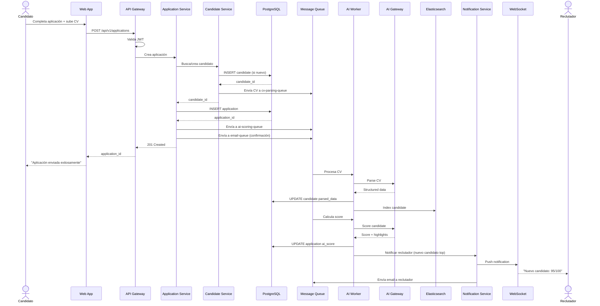

---

## Estrategia de Escalabilidad

### **Horizontal Scaling**
- **Application servers**: Auto-scaling groups (min: 2, max: 20)
- **Workers**: Escala según profundidad de queues
- **Database read replicas**: Añadir según carga de analytics

### **Vertical Scaling**
- **Database primary**: Upgrade de instancia en horarios de bajo tráfico
- **Redis**: Redis Cluster con sharding automático

### **Caching Strategy**
- **L1**: In-memory cache en cada instancia (5 min TTL)
- **L2**: Redis centralizado (1 hora TTL)
- **L3**: CDN para assets estáticos

### **Multi-Region** (Roadmap)
- **Fase 1**: US-East (primario)
- **Fase 2**: EU-West (compliance GDPR)
- **Fase 3**: APAC (latency reduction)

---

## Seguridad

### **Data Security**
- **Encryption at rest**: AES-256 para DB y S3
- **Encryption in transit**: TLS 1.3
- **PII handling**: Tokenización de datos sensibles
- **GDPR compliance**: Right to erasure, data portability

### **Application Security**
- **Input validation**: Sanitización estricta
- **SQL injection prevention**: Prepared statements
- **XSS protection**: Content Security Policy
- **CSRF protection**: Tokens en forms
- **Rate limiting**: Por IP y por tenant

### **Infrastructure Security**
- **VPC isolation**: Private subnets para DB y workers
- **Security groups**: Whitelist estricta
- **WAF**: Protección contra OWASP Top 10
- **Secret management**: AWS Secrets Manager / HashiCorp Vault

---

## Disaster Recovery

### **Backup Strategy**
- **Database**: Snapshots automáticos cada 6 horas
- **Point-in-time recovery**: Hasta 7 días atrás
- **Object storage**: Versioning habilitado + cross-region replication

### **RTO/RPO**
- **Recovery Time Objective**: <2 horas
- **Recovery Point Objective**: <5 minutos de datos perdidos

### **Incident Response**
1. Detección automática vía monitoring
2. Alerting a on-call engineer
3. Runbooks automatizados para escenarios comunes
4. Post-mortem obligatorio

---

## Stack Tecnológico Recomendado

### **Frontend**
- **Framework**: Next.js 14 (React 18)
- **State Management**: Zustand / Redux Toolkit
- **UI Library**: Tailwind CSS + shadcn/ui
- **Forms**: React Hook Form + Zod
- **API Client**: TanStack Query (React Query)

### **Backend**
- **Runtime**: Node.js 20 LTS
- **Framework**: Express.js / Fastify
- **Language**: TypeScript
- **ORM**: Prisma / TypeORM
- **Validation**: Zod

### **Database**
- **Primary**: PostgreSQL 16
- **Cache**: Redis 7
- **Search**: Elasticsearch 8

### **Infrastructure**
- **Cloud Provider**: AWS (o GCP como alternativa)
- **IaC**: Terraform / AWS CDK
- **CI/CD**: GitHub Actions / GitLab CI
- **Containers**: Docker + Kubernetes (EKS) / ECS

### **AI/ML**
- **LLM**: OpenAI GPT-4 + Anthropic Claude
- **Vector DB**: Pinecone / pgvector (PostgreSQL extension)
- **ML Framework**: Python + scikit-learn + Hugging Face

---

## Estimación de Recursos (Fase MVP)

### **Team**
- 1 Product Manager
- 1 Tech Lead
- 3 Full-stack Engineers
- 1 AI/ML Engineer
- 1 DevOps Engineer
- 1 UX Designer

### **Timeline**
- **Fase 1 (3 meses)**: Core ATS (jobs, applications, basic pipeline)
- **Fase 2 (2 meses)**: AI features (screening, scoring)
- **Fase 3 (2 meses)**: Collaboration features (interviews, evaluations)
- **Fase 4 (1 mes)**: Analytics dashboard
- **Total MVP**: 8 meses

### **Infrastructure Costs** (estimado mensual)
- **Compute**: $1,500 (EC2/ECS)
- **Database**: $800 (RDS Multi-AZ)
- **Storage**: $300 (S3)
- **AI APIs**: $2,000-5,000 (variable según uso)
- **Monitoring**: $200
- **CDN**: $150
- **Total**: ~$5,000-8,000/mes (primeros 100 clientes)

# DIAGRAMA C4 - CANDIDATE MANAGEMENT SERVICE

Voy a crear el diagrama C4 completo para el **Candidate Management Service**, siguiendo el modelo de Simon Brown con los 4 niveles de abstracción.

---

## Nivel 1: System Context Diagram

Muestra cómo el Candidate Management Service se relaciona con usuarios y sistemas externos.

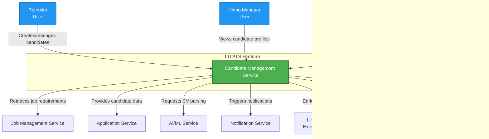

---

## Nivel 2: Container Diagram

Descompone el Candidate Management Service en sus contenedores principales.

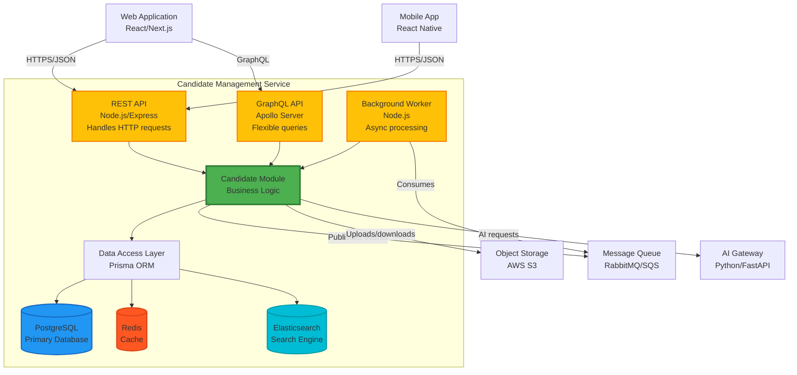

---

## Nivel 3: Component Diagram

Detalla los componentes internos del Candidate Management Service.

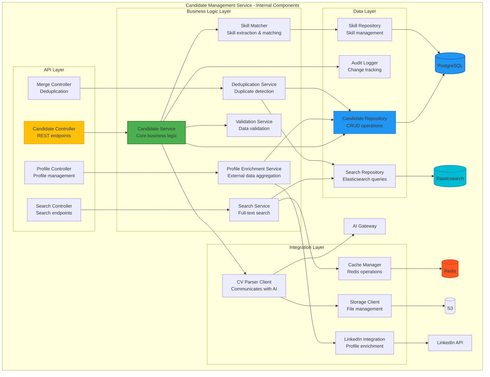

---

## Nivel 4: Code Diagram (Clases Principales)

Muestra las clases/interfaces clave y sus relaciones.

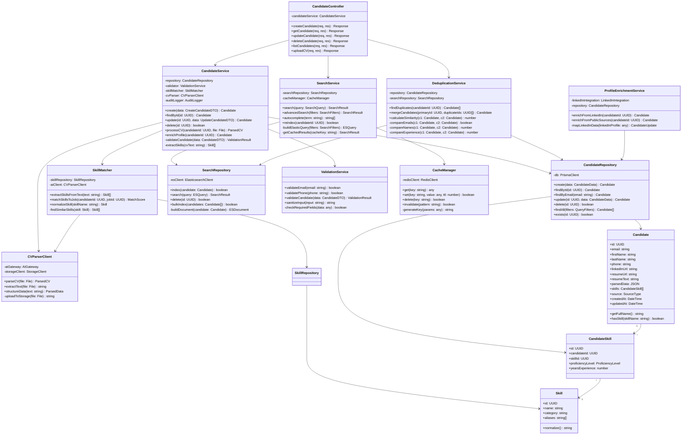

---

## Descripción Detallada de Componentes

### **API Layer**

#### **1. CandidateController**
- **Responsabilidad**: Manejo de requests HTTP para operaciones CRUD de candidatos
- **Endpoints principales**:
  - `POST /api/v1/candidates` - Crear candidato
  - `GET /api/v1/candidates/:id` - Obtener candidato
  - `PUT /api/v1/candidates/:id` - Actualizar candidato
  - `DELETE /api/v1/candidates/:id` - Eliminar candidato
  - `POST /api/v1/candidates/:id/cv` - Upload de CV
- **Validaciones**: Request schema validation, authentication, authorization

#### **2. SearchController**
- **Responsabilidad**: Búsqueda y filtrado de candidatos
- **Endpoints principales**:
  - `GET /api/v1/candidates/search?q=...` - Búsqueda full-text
  - `POST /api/v1/candidates/search/advanced` - Búsqueda con filtros complejos
  - `GET /api/v1/candidates/autocomplete?term=...` - Autocompletado
- **Features**: Paginación, ordenamiento, faceted search

#### **3. ProfileController**
- **Responsabilidad**: Enriquecimiento y gestión avanzada de perfiles
- **Endpoints principales**:
  - `POST /api/v1/candidates/:id/enrich` - Enriquecer desde LinkedIn
  - `GET /api/v1/candidates/:id/history` - Historial de cambios
  - `PATCH /api/v1/candidates/:id/tags` - Gestión de tags

#### **4. MergeController**
- **Responsabilidad**: Detección y fusión de duplicados
- **Endpoints principales**:
  - `GET /api/v1/candidates/:id/duplicates` - Encontrar duplicados
  - `POST /api/v1/candidates/merge` - Fusionar candidatos
  - `GET /api/v1/candidates/:id/similarity/:otherId` - Score de similitud

---

### **Business Logic Layer**

#### **1. CandidateService** (Core)
- **Responsabilidad**: Lógica de negocio principal
- **Funciones clave**:
  - Validación de datos de entrada
  - Orquestación de parsing de CV
  - Extracción y matching de skills
  - Aplicación de reglas de negocio
  - Auditoría de cambios
- **Dependencias**: Repository, Validator, SkillMatcher, CVParser

#### **2. SearchService**
- **Responsabilidad**: Búsqueda avanzada con caching
- **Funciones clave**:
  - Construcción de queries Elasticsearch
  - Gestión de caché de resultados frecuentes
  - Indexación automática de nuevos candidatos
  - Faceted search (filtros por skills, experiencia, ubicación)
- **Performance**: Cache hit rate >80% para búsquedas comunes

#### **3. ProfileEnrichmentService**
- **Responsabilidad**: Enriquecimiento de perfiles desde fuentes externas
- **Fuentes**:
  - LinkedIn API (con autorización del candidato)
  - GitHub API (para perfiles técnicos)
  - Public web scraping (cuando legal)
- **Rate Limiting**: Respeta límites de APIs externas

#### **4. DeduplicationService**
- **Responsabilidad**: Detección y fusión de candidatos duplicados
- **Algoritmo**:
  - Email exact match (100% match)
  - Nombre + apellido fuzzy match (>90% similar)
  - LinkedIn URL match (100% match)
  - Phone normalization + match
- **Merge strategy**: Conserva el candidato más completo como primario

#### **5. SkillMatcher**
- **Responsabilidad**: Extracción y normalización de skills
- **Features**:
  - Detección de skills desde texto libre
  - Normalización (ej: "JS" → "JavaScript")
  - Agrupación por categorías (frontend, backend, soft skills)
  - Matching con requisitos de job postings
- **ML Model**: Fine-tuned BERT para skill extraction

#### **6. ValidationService**
- **Responsabilidad**: Validación y sanitización de datos
- **Validaciones**:
  - Email format y dominio válido
  - Phone number format internacional
  - URL validation
  - XSS/SQL injection prevention
  - GDPR compliance checks

---

### **Integration Layer**

#### **1. CVParserClient**
- **Responsabilidad**: Comunicación con AI Gateway para parsing
- **Flujo**:
  1. Upload de CV a S3
  2. Request a AI Gateway con S3 URL
  3. Polling o webhook para resultado
  4. Estructuración de datos parseados
- **Retry logic**: Exponential backoff si AI Gateway falla
- **Formatos soportados**: PDF, DOCX, TXT, HTML

#### **2. LinkedInIntegration**
- **Responsabilidad**: Integración con LinkedIn API
- **OAuth Flow**: 3-legged OAuth para autorización de candidato
- **Data mapping**: LinkedIn profile → Candidate model
- **Rate limiting**: Max 100 requests/day por app

#### **3. StorageClient**
- **Responsabilidad**: Gestión de archivos en S3
- **Operaciones**:
  - Upload con pre-signed URLs
  - Download con URLs temporales (expiración: 1 hora)
  - Delete cascading cuando candidato es eliminado
- **Organización**: `/company_id/candidates/candidate_id/cv.pdf`

#### **4. CacheManager**
- **Responsabilidad**: Abstracción de Redis
- **Estrategias de cache**:
  - **Candidate by ID**: TTL 1 hora
  - **Search results**: TTL 15 minutos
  - **Skill catalog**: TTL 24 horas
- **Invalidation**: Automática cuando candidato se actualiza

---

### **Data Layer**

#### **1. CandidateRepository**
- **Responsabilidad**: Acceso a datos en PostgreSQL
- **Patrones**:
  - Repository pattern
  - Unit of Work para transacciones
  - Soft deletes (is_deleted flag)
- **Queries optimizadas**: Eager loading de skills para evitar N+1

#### **2. SkillRepository**
- **Responsabilidad**: CRUD de skills y relaciones
- **Features**:
  - Búsqueda de skills por categoría
  - Detección de skills similares (Levenshtein distance)
  - Skill normalization cache

#### **3. SearchRepository**
- **Responsabilidad**: Operaciones Elasticsearch
- **Índice**: `candidates_v1`
- **Mappings**:
```json
{
  "properties": {
    "full_name": {"type": "text", "analyzer": "standard"},
    "email": {"type": "keyword"},
    "skills": {"type": "keyword"},
    "resume_text": {"type": "text", "analyzer": "english"},
    "experience_years": {"type": "integer"},
    "location": {"type": "geo_point"}
  }
}
```

#### **4. AuditLogger**
- **Responsabilidad**: Tracking de cambios
- **Logs**:
  - Quién modificó qué y cuándo
  - Valores anteriores vs nuevos (JSON diff)
  - IP y user agent
- **Retención**: 2 años para compliance

---

## Flujos de Interacción Clave

### **Flujo 1: Crear Candidato con CV**

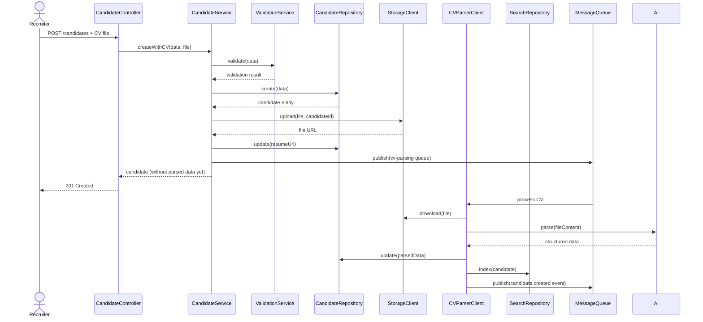

### **Flujo 2: Búsqueda Avanzada**

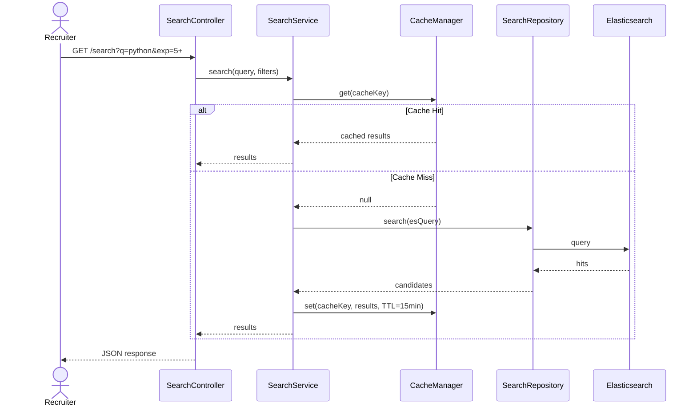

### **Flujo 3: Deduplicación y Merge**

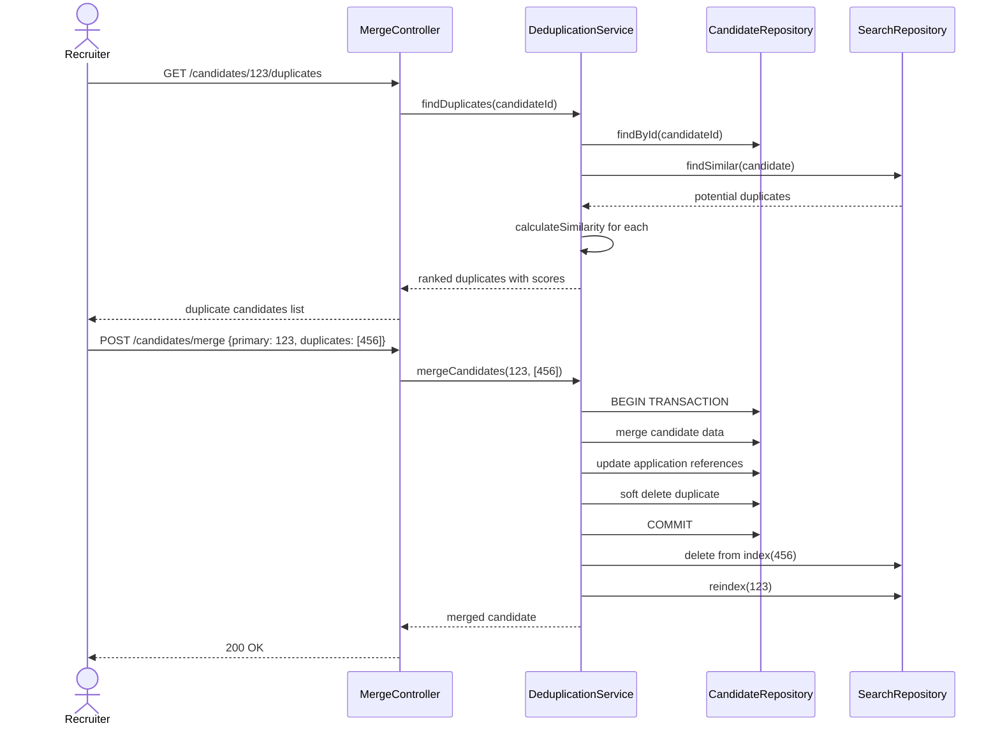

---

## Consideraciones de Diseño

### **1. Multi-Tenancy**
- **Estrategia**: Shared database con `company_id` en todas las tablas
- **Isolation**: Row-level security + application-level filtering
- **Performance**: Índices compuestos en `(company_id, id)`

### **2. Escalabilidad**
- **Horizontal**: Service stateless, múltiples instancias
- **Database**: Read replicas para queries pesadas (búsquedas)
- **Caching**: Redis para reducir load en DB (>80% hit rate)

### **3. Seguridad**
- **PII Encryption**: Datos sensibles encriptados at-rest
- **Access Control**: RBAC + field-level permissions
- **Audit Trail**: Todos los cambios logueados
- **GDPR**: Right to erasure implementado (soft + hard delete)

### **4. Resiliencia**
- **Circuit Breaker**: Para llamadas a AI Gateway y APIs externas
- **Retry Logic**: Exponential backoff con jitter
- **Fallbacks**: Modo degradado si Elasticsearch falla (fallback a PostgreSQL)
- **Timeouts**: Agresivos en endpoints user-facing (<500ms)
